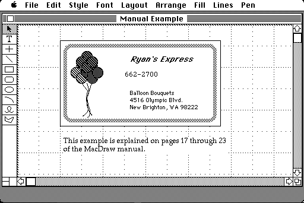

# MacPlus Kiosk 20Mb Disk Image

This is a MacPlus ZuluSCSI image to be used in a kiosk setup (free use of the computer).

Kiosk mode allows the image to be recreated at each power-on.

This image is intended to be used with a ZuluSCSI in kiosk mode (image renamed to end in `.ori`), so it is fresh after each power-up (a new feature of the ZuluSCSI firmware; you need firmware version >= v2025.08.06).

With this image, you can let users play with the Mac as much as they want, knowing that at the next power-up, it will be fresh as new.

The image is 20Mb, which was the size of an Apple SCSI disk, and showcases what a MacPlus was.

The software included is period-accurate for MacPlus users (mostly 1984-1989+).

---
# System

The system is the latest System 6 that runs on the Mac Plus. While it currently runs on any mac, I plan to save some space and make it Mac Plus only

---

## System 6.0.8

The latest System 6 for the Plus, with SCSIProbe included as it helps to investigate eventual issues with the Zulu volumes.

## After Dark 1.0

The first version of After Dark (sorry, no toasters) is active, so the screen doesn't burn out.

## MultiFinder

MultiFinder is present, but not activated, as this would lead to users launching multiple programs and ending up confused by memory errors. You can demo MultiFinder by activating it with the "Set Startup..." option of the "Special" menu and restarting.

Beware that some applications may not be MultiFinder friendly.

At next power cycle (ie: off/on), the system will be back to normal Finder.

## ResEdit

A copy of ResEdit is hidden in the System folder. As surprising as it seems, ResEdit was a common way to spend time exploring the resource forks of installed applications and documents. It is a later 1994 version, but I haven't included the disassembler (I should, or I should downgrade to an '80s version).

## HyperCard 1.2.5

At the top level, HyperCard is included, with all the demo stacks. Just launch it by double-clicking it and you'll be greated by the "Home Stack".

The slide show contains some iconic dithered Mac images:

---
# Applications

The set of bundled applications represent a typical set of "serious" applications you could find on a Mac.

---

## Image Processing

A few image processing applications are bundled:

---
### MacPaint 1.5

The almost original MacPaint, with Woodblock, the famous image of the Japanese Lady by Susan Kare.

Woodblock has been edited so the image is well positioned. Opening it will re-create the iconinc MacPain intro image.

---
### Photoshop 1.0.7

The original Photoshop, with a few images from the period: a couple of 8-bit and another 1-bit scan.

---
### MacDraw 1.9.5

MacDraw was an impressive vector drawing program (well, at least until Illustrator 88), and is included for the whole trilogy.

---
### Adobe Illustrator 88 1.9.5

It is hard to overstate the incredible technical achievement that was rendering PostScript interactively on-screen with the Illustrator Editor. Included is Adobe Type Manager, which was able to bring vectorized fonts to all Macs.

## Business Applications

While there were many others, 3 business-oriented applications are included.

---
### Excel 1.5

The Mac was a serious business machine, which is why Microsoft built a competitor to 1-2-3, but in a GUI. This is Excel; it was ported/rewritten for Windows 2 years later.

---
### PowerPoint 1.0

It isn't common knowledge that PowerPoint was a Mac software before being a Windows one. Even less known is the fact that it wasn't a Microsoft-designed product, but was designed by Forethought...

It is impressive that some features are still there 38 years later.

---
### MacWrite 1.6

As MacPaint is included, MacWrite has to be included too. There is no sample document, but I am open to including one (and maybe some demo fun fonts).

## Music Applications

While the Atari ST was the king of music applications thanks to its built-in MIDI ports and lower cost, the Mac had a good set of Music creation applications early, thanks to its digital sound and became the main music system in the 90s.

---
### Music Works

Music Works lets you compose and play complex (for the time) partitions.

---
### Studio Session

An extremely skeuomorphic music composing and playing software. Chuck Roast is still burnt into my mind 35 years later (and if anyone knows the reason for the mysterious 16 mixing pixels on the right of the screen, I'd love to hear from you).

# Games

While the Mac was not a "classic" gaming machine, mainly due to its black and white output, no hardware accelerations and lack of joystick, there were quite a lot of games on the platform.

## Games

I included a bunch of typical games.

They are roughly ordered by date, from early classic Mac time wasters, down to full blown solid Mac-specific hits.

---
### Missile Command

A very early classic on the Mac 128k that still works on the Plus.

---
### MacsBugs!

I spent more time than I'd like to confess on this game. The instructions are made of awesome. Not to confuse with the MacsBug debugger, another really *fun* Mac application...

---
### MasterCode

A graphical twist on the classic Master Mind. Beware of duplicates!

---
### LunarLander

A graphical rendition of the classic Lunar Lander game.

---
### Airborne!

Another classic, very early Mac 128K assembly game.

---
### Mac Missiles

Another Missile Commander clone. But the most interesting thing here is by far the name of the developer... (Avie Tevanian Jr, designer of the Mach kernel, principal architect of NeXTStep and Apple CTO)

---
### Reversi

A simple game of Othello.

---
### On-the-Contrary

A multiplayer Memory game.

---
### Zork I

Text adventure games were the most immersive games at the time, and InfoCom offering were available on all platforms, thanks to their portable design (including the original Mac, of course!)

---
### Third Dimension

A take on a 3d tic-tac-toe-like, surprisingly playable!

---
### Solitaire

I spent way more time than I will admit with this game back in the days. And if I win, I will update the screenshot...

---
### Rogue

This is Rogue. It is not a rogue-like game, it is THE original Rogue, ported to the Macintosh.

---
### Dungeon of Doom

Easy to notice the inspiration of this game: notice how Rogue (above) said "Welcome to the Dungeon of Doom" as an intro.

---
### 1000 Miles

Used to play the card version whith my brother in the 70s...

---
### Oregon Trail

The port of the classic Apple ][ game that everyone seems to have played at school in the US. Less known in Europe, but a classic none theless

---
### Checkers

A simple game of checkers, typical of the first games for the Mac.

---
### Shangai

An addictive mah-jong solitaire game. Almost as addictive as the color version.

---
### Spacebubble

An interesting take on the Space Invaders concept, using the mouse for an extremely fast ship movement.

[Save the planet!](image-14.png)

---
### Star Wars

Impressive 3d wireframe space shooter. Use the force!

---
### Tetris

The classic Tetris for the classic Macs. High scores have been reset, so every day is a new opportunity!

---
### Risk

A classic time-waster for early Macs.

---
### Lode Runner

The port of the Apple ][ game. Anyone who tells you that Lode Runner isn't the best game ever is wrong.

---
### Dark Castle

**The** platformer for Mac. Beautiful graphics, an absolute classic.

---
### Shufflepuck Cafe

**The** action game for the Mac. Purely written using the toolbox, zero assembly. Another absolute classic for the Mac.

---
### Deja Vu

A beautiful, very Mac-like, point-and-click game, with a very mac-like interaction, using both the mouse and multiple windows.

---
### Psion Chess

Nothing more relaxing than a little game of Chess...

---
### The Fools' Errand

An absolutely incredible adventure/puzzle game. There is no way to finish it in a kiosk sitting, but this is an absolute masterpiece.

---
### Kid Pix

A fun drawing program for kids!

---
## Have fun exploring 20Mb of software for the Mac Plus!
