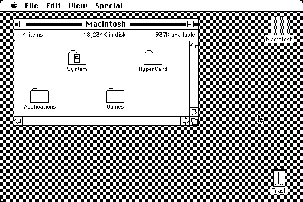

# MacPlus Kiosk 20Mb Disk Image

This is a MacPlus ZuluSCSI image to be used in a kiosk setup (free use of the computer).

Kiosk mode allows the image to be recreated at each power-on.

This image is intended to be used with a ZuluSCSI in kiosk mode (image renamed to end in `.ori`), so it is fresh after each power-up (a new feature of the ZuluSCSI firmware; you need firmware version >= v2025.08.06).

With this image, you can let users play with the Mac as much as they want, knowing that at the next power-up, it will be fresh as new.

The image is 20Mb, which was the size of an Apple SCSI disk, and showcases what a MacPlus was.

The software included is period-accurate for MacPlus users (mostly 1984-1989+).

The image contains:

## System 6.0.8

The latest System 6 for the Plus.

SCSIProbe is included.

The first version of After Dark (sorry, no toasters) is active, so the screen doesn't burn out.

MultiFinder is not installed, as this would lead to users launching multiple programs and ending up confused by memory errors.

## HyperCard 1.2.5

At the top level, HyperCard is included, with all the demo stacks.

The slide show contains some iconic dithered Mac images:

## Applications

A few applications are bundled:

### MacPaint 1.5

The almost original MacPaint, with Woodblock, the famous image of the Japanese Lady by Susan Kare.

Woodblock has been edited so the image is well positioned.

### Photoshop 1.0.7

The original Photoshop, with a few images from the period: a couple of 8-bit and another 1-bit scan.

### MacWrite 1.6

As MacPaint is included, MacWrite has to be included too. There is no sample document, but I am open to including one (and maybe some demo fun fonts).

### MacDraw 1.9.5

MacDraw was an impressive vector drawing program (well, at least until Illustrator 88), and is included for the whole trilogy.

### Adobe Illustrator 88 1.9.5

It is hard to overstate the incredible technical achievement that was rendering PostScript interactively on-screen with the Illustrator Editor. Included is Adobe Type Manager, which was able to bring vectorized fonts to all Macs.

### Excel 1.5

The Mac was a serious business machine, which is why Microsoft built a competitor to 1-2-3, but in a GUI. This is Excel; it was ported/rewritten for Windows 2 years later.

### PowerPoint 1.0

It isn't common knowledge that PowerPoint was a Mac software before being a Windows one. Even less known is the fact that it wasn't a Microsoft-designed product, but was designed by Forethought...

It is impressive that some features are still there 38 years later.

### Microsoft Word 4.0

For completeness of the Microsoft Office suite, I chose to include Word 4.0.

### Studio Session

An extremely skeuomorphic music composing and playing software. Chuck Roast is still burnt into my mind 35 years later (and if anyone knows the reason for the mysterious 16 mixing pixels on the right of the screen, I'd love to hear from you).

### ResEdit

As surprising as it seems, ResEdit was a common way to spend time exploring the resource forks of installed applications and documents. It is a later 1994 version, but I haven't included the disassembler (I should, or I should downgrade to an '80s version).

## Games

I included a bunch of typical games.

### Lode Runner 1.0

The port of the Apple ][ game. Anyone who tells you that Lode Runner isn't the best game ever is wrong.

### Solitaire

I spent way more time than I will admit with this game. And if I win, I will update the screenshot...

### LunarLander

A graphical rendition of the classic Lunar Lander game.

### Shangai

An addictive mah-jong solitaire game. Almost as addictive as the color version.

### Dungeon of Doom 4.0

One of the first graphical rogue-likes.

### Reversi

A simple game of Othello.

### Missile Command

A very early classic on the Mac 128k that still works on the Plus.

### Risk

A classic time-waster for early Macs.

### Mac Missiles 1.0

Another Missile Commander clone. But the most interesting thing here is by far the name of the developer...

### The Fools' Errand 1.1

An absolutely incredible adventure/puzzle game. There is no way to finish it in a kiosk sitting, but this is an absolute masterpiece.

### Tetris

The classic Tetris for the classic Macs. High scores have been reset, so every day is a new opportunity!

### Dark Castle

**The** platformer for Mac. Beautiful graphics, an absolute classic.

### Shufflepuck Cafe 1.0

**The** action game for the Mac. Purely written using the toolbox, zero assembly. Another absolute classic for the Mac.

### Psion Chess

Nothing more relaxing than a little game of Chess...

### Airborne! 1.0

Another classic, very early Mac 128K assembly game.

### MacsBugs!

I spent more time than I'd like to confess on this game. The instructions are made of awesome.

### Deja Vu II -- Lost in Las Vegas

A beautiful, very Mac-like, point-and-click game.

### Captain BLOOD

A famous game on the Atari ST, ported to many platforms. It only works on the MacPlus and you may understand why it is included by looking at the Credits screen...

